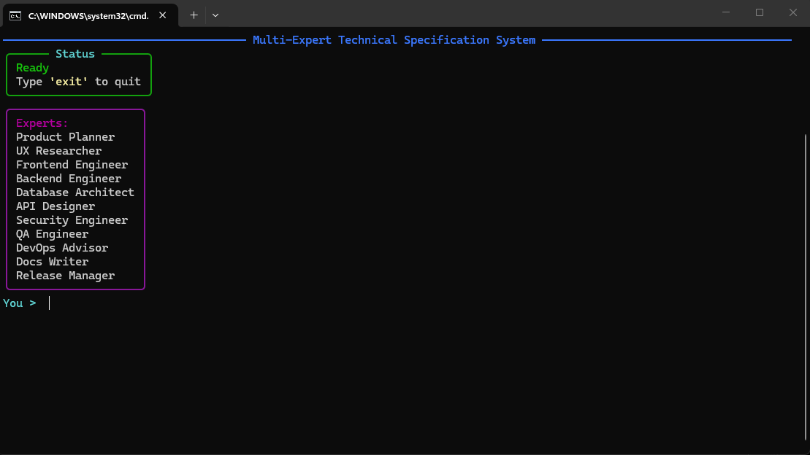
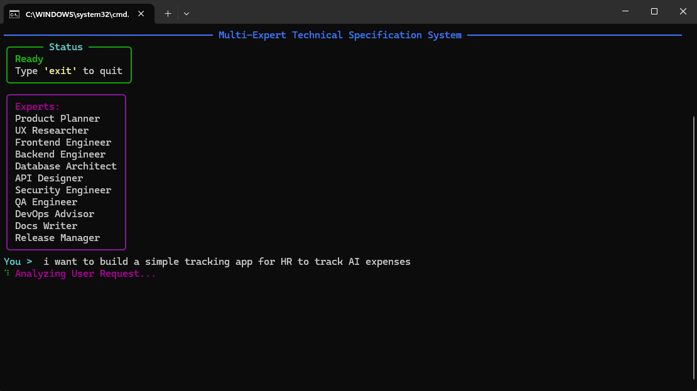
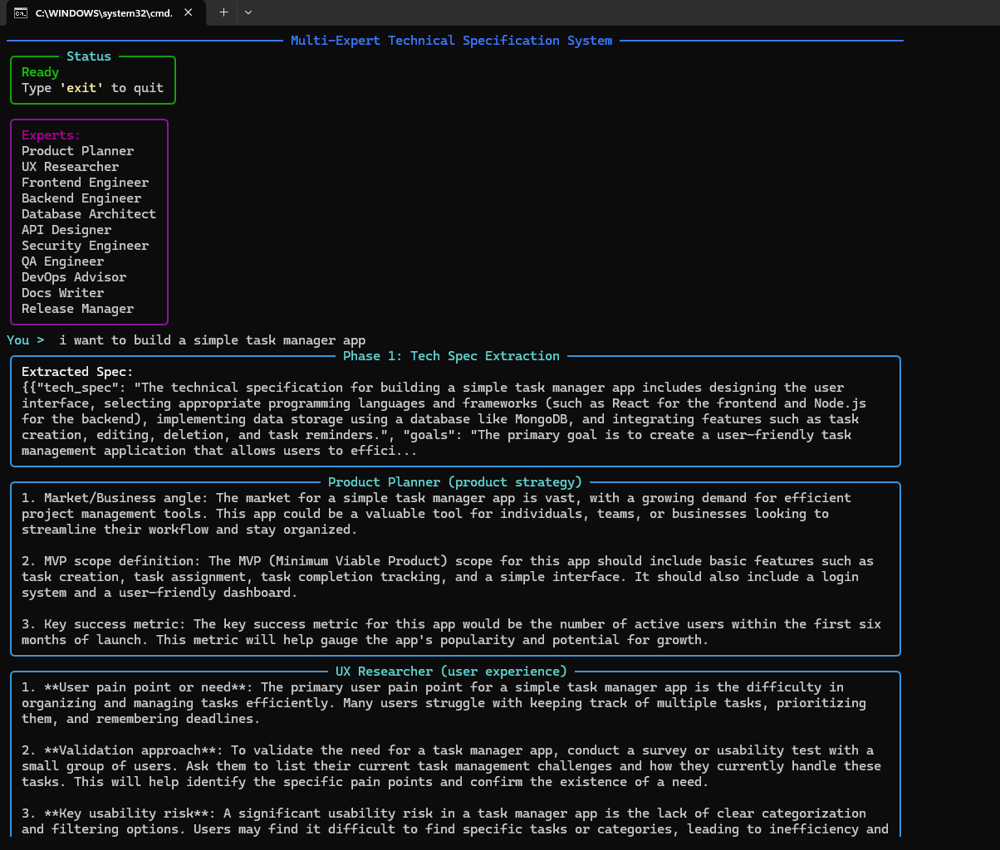
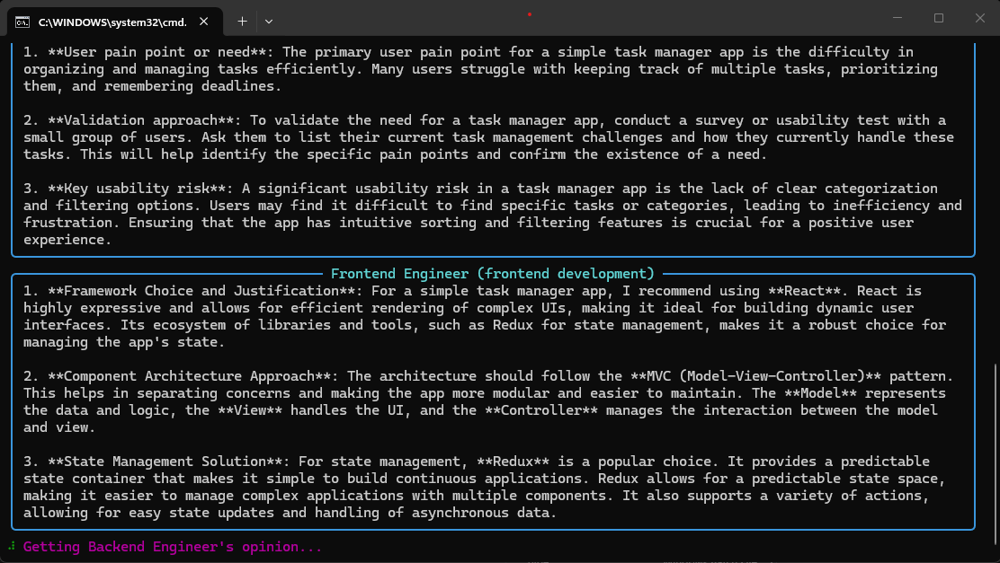
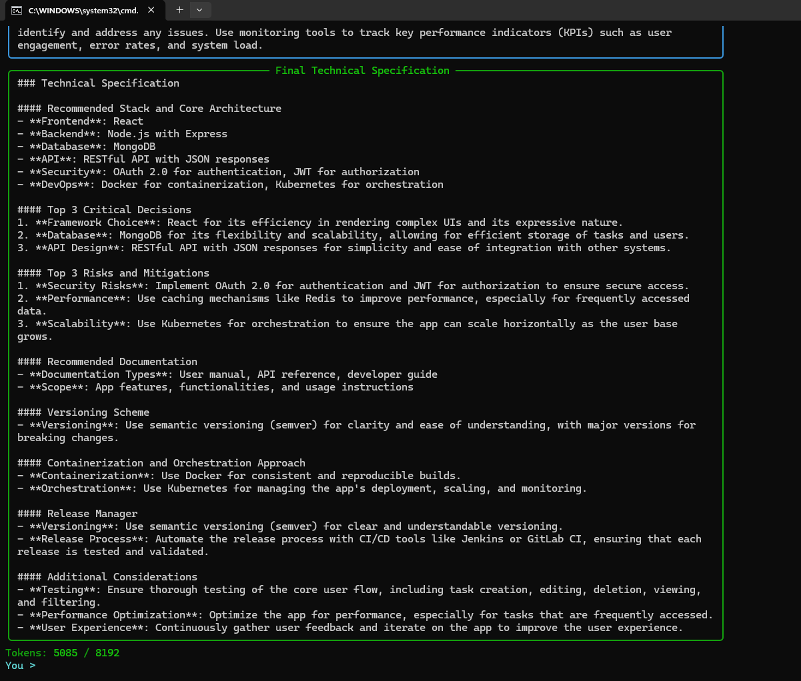

# Tiny Local Multi-Agent System 

[](https://www.python.org/downloads/)
[](LICENSE)
[](https://github.com/yourusername/local-llm-system)
[](https://github.com/astral-sh/uv)

A **lightweight, self-contained** Python project for running a multi-expert technical specification system with local LLMs. This system uses **[Qwen2.5-1.5B](https://huggingface.co/Qwen/Qwen2.5-1.5B-Instruct-GGUF)** and **[llama-cpp-python](https://github.com/abetlen/llama-cpp-python)** for inference, and **[Rich](https://github.com/Textualize/rich)** for a **user-friendly console interface**. It orchestrates multiple expert agents to extract technical specifications, gather specialized opinions, and synthesize comprehensive reports from user queries.



---

##  **Features**
- **Out-of-the-box experience**: Just run `run_app.bat` to install dependencies and start.
- **Minimal dependencies**: Uses **[UV](https://github.com/astral-sh/uv)** for fast dependency resolution and virtual environment management.
- **Multi-expert system**: Orchestrates multiple specialized agents to provide diverse perspective on user queries.
- **3-phase processing**: Tech spec extraction -> specialist opinions -> synthesis into comprehensive reports.
- **Rich console UI**: Interactive interface with syntax highlighting and formatted panels.
- **Configurable agents**: Define agent personalities and roles in `agents.json`.
- **Self-contained model**: Includes the Qwen2.5-1.5B GGUF model file for immediate use.

---

##  **Project Structure**
```bash
local-llm-system/
├── .venv/                  # Python virtual environment (auto-created)
├── app/
│   ├── llm/
│   │   ├── agent_manager/  # Manages agent configuration and execution
│   │   │   ├── agents.json # Agent personalities and system prompts
│   │   │   └── service.py  # Agent orchestration logic
│   │   ├── query_manager/  # Handles query processing pipeline
│   │   │   └── service.py  # 3-phase query processing
│   │   ├── engine/         # LLM inference engine
│   │   │   └── service.py  # Model loading and inference
│   │   └── chat.py         # Console UI and main loop
│   ├── models/             # Contains the GGUF model file
│   │   └── qwen2.5-1.5b-instruct-q8_0.gguf
│   └── app.py              # Main entry point
├── pyproject.toml          # Project metadata and dependencies
├── README.md               # Project documentation
├── run_app.bat             # Script to install dependencies and run the app
└── uv.lock                 # Lockfile for reproducible dependency resolution
```

# Prerequisites

Windows OS (for .bat script compatibility)
Python 3.10 or higher (recommended: 3.11+)
Internet connection (only for initial dependency installation)
~500MB disk space for the Qwen2.5-1.5B GGUF model

# Getting Started
1. Download the Project
Download the project and extract it to a folder of your choice.

2. Run the Application
Double-click run_app.bat or run it from the command line:

```bash
run_app.bat
```

This will:

Install uv (if not already installed)
Create a virtual environment (.venv)
Sync dependencies using uv sync
Run the application with uv run app/app.py

3. Start Using the System
Enter your query (e.g., "I want to build a task manager app")
The system will extract a tech spec, gather expert opinions, and synthesize a comprehensive specification
Review the results and token usage metrics


---


# How It Works

1. Dependency Management

The project uses UV for fast dependency resolution and virtual environment management. Dependencies are listed in pyproject.toml and installed automatically when you run run_app.bat.

2. Model Loading

engine.py loads the Qwen2.5-1.5B model from the app/models/ directory using llama-cpp-python. The model is configured with:

Context length: 8192 tokens
Threads: 8 (adjustable based on your CPU)
Verbose mode: Off

3. Multi-Expert Specification Pipeline

When the user submits a query, the system executes three phases:

**Phase 1: Technical Spec Extraction**
A system synthesizer agent analyzes the user query and extracts key technical requirements into a structured specification.

**Phase 2: Specialist Opinions**
Multiple expert agents (each with unique specialties) evaluate the query and provide domain-specific insights and recommendations.

**Phase 3: Synthesis**
The synthesizer consolidates all specialist opinions into a comprehensive, well-reasoned technical specification report.

The final report is displayed to the user with token usage metrics for transparency.

4. User Interface

chat.py creates a rich console interface that:

Accepts user queries in a simple input loop.
Displays processing status updates during each phase.
Shows phase results in formatted panels for clarity.
Displays token usage metrics to track LLM efficiency.

5. Main Application

app.py initializes the agent manager and starts the query processing loop.

# Customization
Agent Configuration
Edit `app/llm/agent_manager/agents.json` to:

Add/remove specialist agents
Define agent names, specialties, and system prompts
Configure phase prompts for tech spec extraction and synthesis

LLM Settings
Edit `app/llm/query_manager/service.py` to adjust:

max_tokens: Response length limits per phase
temperature/top_p: Control response randomness per agent
Token budget: Adjust total token allocation for synthesis

Model Replacement
Replace the GGUF model in `app/models/` with any compatible GGUF file (e.g., from Hugging Face).

# Troubleshooting

Missing dependencies: Ensure `run_app.bat` completes without errors. If issues persist, run `uv sync` manually.

Model not found: Verify the GGUF file is in `app/models/` and named `qwen2.5-1.5b-instruct-q8_0.gguf`.

Slow processing: Reduce `max_tokens` values in query_manager/service.py or use a smaller model file.

# License
This project is open-source and free to use. The TinyLlama model is licensed under its respective terms (see Hugging Face).

# Acknowledgments

**llama-cpp-python** for LLM inference.
**Rich** for the console UI.
**Qwen2.5** for the language model.
**UV** for fast dependency management.

# Notes

The .venv directory is auto-created by uv sync.
The uv.lock file ensures reproducible dependency resolution.

## Screenshots

### System Startup


### Processing Query


### Phase Results


### Detailed Response Output


### Final Specification



# Download
[![Download the latest release]]([https://github.com/CosmonautCode/Tiny-Local-LLM-System](https://github.com/CosmonautCode/Tiny-Local-Multi-Agent-System/tree/main))


## ⭐ Star this repo if you found it useful!

